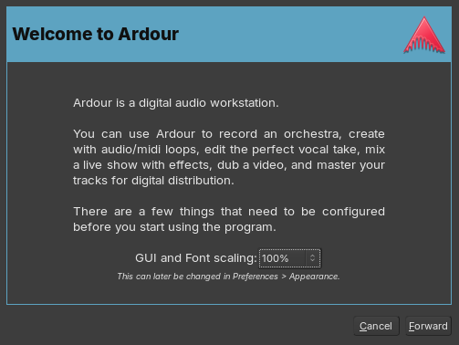
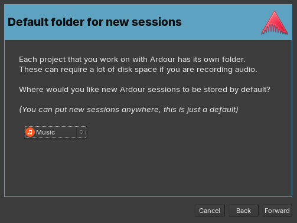
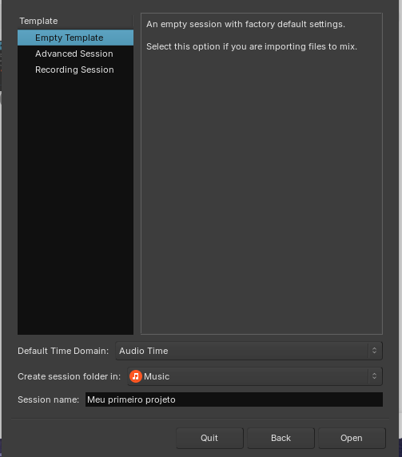
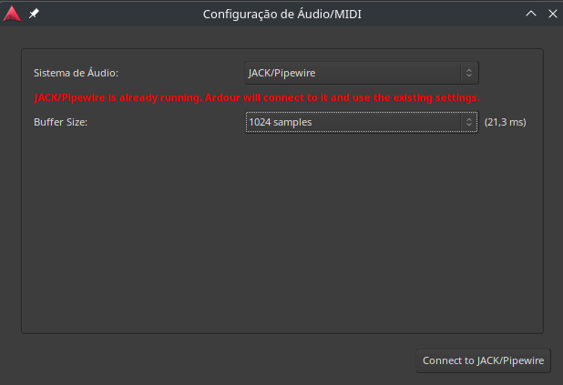
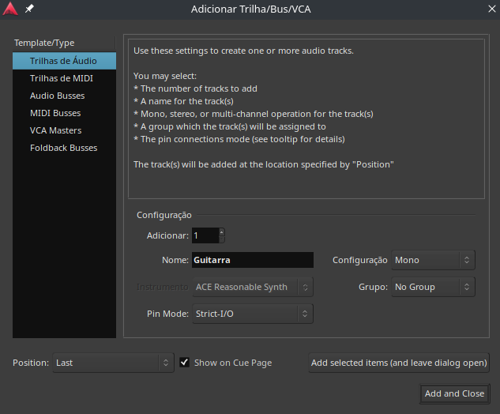
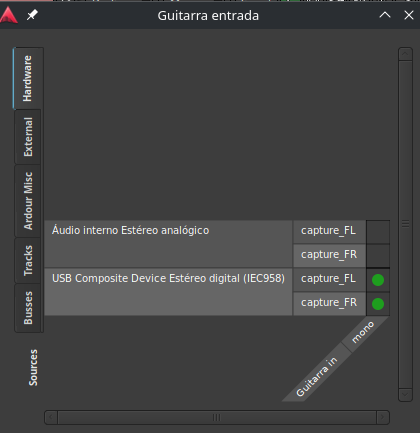
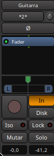
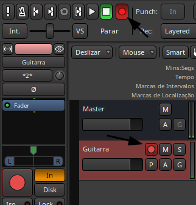

# Introdução ao Ardour: instalação, configuração inicial e gravação

O Ardour é um software profissional para produção musical, ou DAW (Digital Audio Workstation), de código aberto e disponível gratuitamente para GNU/Linux. Apesar de todas as suas funções, não há muitos guias em português sobre o uso do programa e sua configuração inicial, assunto que será abordado neste post.

Não pretendo explicar todo o funcionamento do Ardour, até porque ainda estou aprendendo a utilizá-lo, mas ensinarei como realizar a instalação e algumas configurações importantes que devem ser feitas ao iniciar o seu projeto para que tudo funcione da melhor forma possível. Este post não irá tratar da instalação e uso de plugins, tema que abordarei em um post exclusivo sobre os principais plugins que utilizo.

## Instalação

O processo de instalação varia de acordo com a distribuição Linux utilizada. Recomendo a versão em Flatpak, pois garante que o programa esteja na sua versão mais atual e tem o mesmo processo de instalação independentemente do sistema. Abaixo explico como instalar tanto a versão Flatpak quanto a oficial de algumas distribuições.

Os comandos apresentados devem ser digitados no terminal do seu sistema

### Debian/Ubuntu e derivados

```bash
sudo apt install ardour
```

### Fedora e derivados

```bash
sudo dnf install ardour
```

### Flatpak

Flatpak é um formato de distribuição de softwares que pode ser utilizado em qualquer sistema Linux. Caso o seu sistema ainda não tenha Flatpak habilitado, é possível configurar através da loja de aplicativos ouseguindo as orientações disponíveis no [site oficial do projeto](https://flathub.org/setup).

Após configurar o Flatpak, digite o comando abaixo no terminal:

```bash
flatpak install flathub org.ardour.Ardour
```

## Primeiras configurações

Ao iniciar o Ardour pela primeira vez, será exibida uma tela de boas-vindas onde você pode escolher o tamanho da fonte e dos elementos da interface. Essas configurações podem ser alteradas posteriormente em *Editar > Preferências > Appearance > Size and Scale*. A melhor opção varia de acordo com o seu monitor; no meu caso, mantenho em 100%.



Na etapa seguinte, você definirá onde os projetos serão salvos por padrão. Cada sessão criará sua própria pasta, então escolha o local de sua preferência e avance para a próxima etapa.



## Criando o primeiro projeto

Ao criar seu primeiro projeto, você pode nomear a sessão e escolher começar do zero ou usar um modelo pré-configurado. As opções padrão incluem:

- *Empty Template*: sem configuração;
- *Recording Template*: modelo de gravação;
- *Advanced Template*: modelo avançado.

Pessoalmente, prefiro iniciar projetos sem configurações predefinidas e ajustá-los conforme minhas necessidades.



Nesta etapa, é essencial configurar áudio e MIDI adequadamente. Se estiver no Linux, altere o *Sistema de Áudio* de *ALSA* para *JACK/Pipewire*. Embora outras opções possam funcionar, essa é a que consigo utilizar.

O *Buffer Size* afeta a qualidade do áudio e a latência. Valores altos podem causar delay, enquanto valores baixos podem gerar falhas caso o computador não consiga processar áudio rapidamente. Atualmente, uso 1024 samples, mas recomendo testar para encontrar o ideal para o seu sistema, de acordo com a capacidade do seu processador.

Você pode alterar essas configurações posteriormente em *Editar > Preferências > General > Show Audio/MIDI Setup Window*.



## Gravando seu instrumento

Para gravar seu instrumento, você precisará de uma interface de áudio, que transforma o sinal do instrumento em dados processáveis pelo computador. Existem diversas opções no mercado. Para guitarristas, a Focusrite Scarlett é amplamente recomendada, sendo que o modelo Solo geralmente é suficiente. Eu utilizo uma interface Teyun Q-12 comprada no AliExpress, que tem atendido minhas necessidades.

Na janela do projeto, clique duas vezes abaixo da faixa *Master* para criar uma nova faixa. Dê um nome à faixa e clique em *Add and Close*.



Clique com o botão direito sobre o nome da faixa criada, selecione *Entradas...* e selecione o correspondente à sua interface de áudio. Depois, feche a janela.



Clique com o botão esquerdo no mesmo local para abrir o menu lateral da faixa e ative a opção *In* para ouvir o som processado pelo Ardour. Você pode modificar o som utilizando plugins, tema que abordarei em outro post.



Por fim, para gravar, ative o botão de gravação no topo da janela, selecione o botão de gravação na faixa desejada e pressione *Play*.



Agora é só fazer suas composições e começar a desenvolver suas músicas. Lembrando sempre do mais importante: divirta-se.
